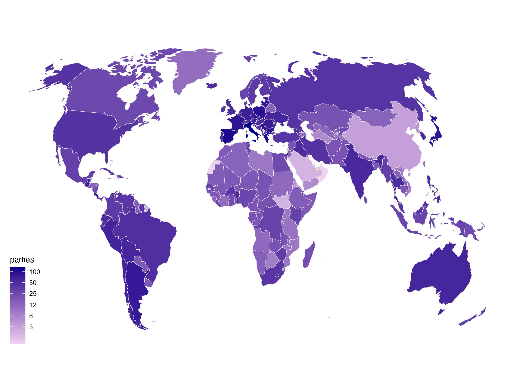
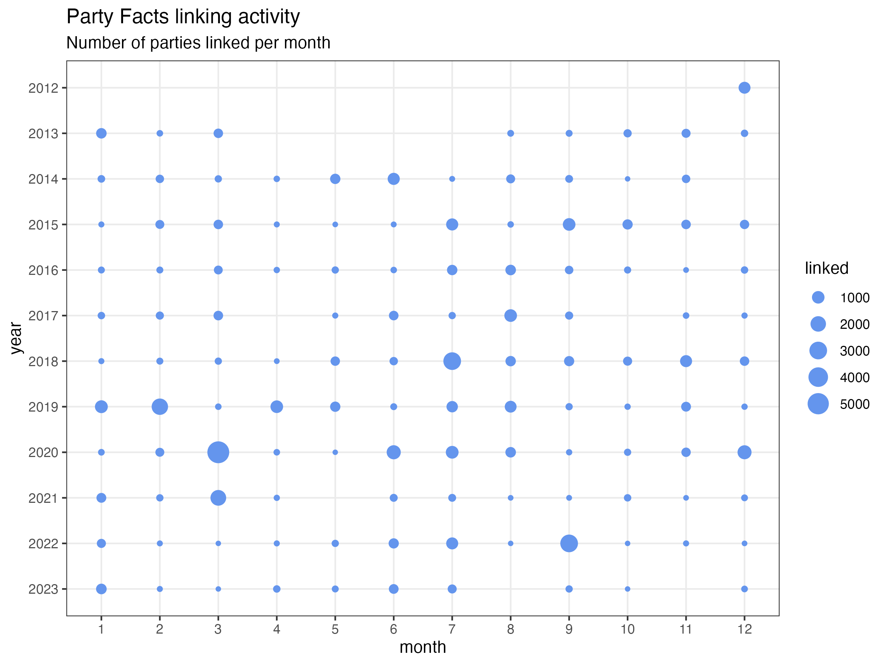

# Party Facts data import

## Authors

- Paul Bederke — GESIS Leibniz Institute for the Social Sciences — since 2019
- Holger Döring — SOCIUM Research Center, University of Bremen — since 2012
- Sven Regel — WZB Berlin Social Science Center — 2012–2023
- \[ _contact information_ — paul.bederke gesis org \]

see full credits at [Party Facts “about section”](https://partyfacts.herokuapp.com/documentation/about/)

## References

Döring, Holger, and Sven Regel. 2019. “Party Facts: A Database of Political Parties Worldwide.” Party Politics 25(2): 97–109. doi: [10.1177/1354068818820671](https://doi.org/10.1177/1354068818820671)

Bederke, Paul, Holger Döring, and Sven Regel. 2019. “Party Facts Dataverse.” — [dataverse.harvard.edu/dataverse/partyfacts](https://dataverse.harvard.edu/dataverse/partyfacts)

## Summary

The [Party Facts project](https://partyfacts.org/) aims to offer a gateway to empirical data about political parties and provides a modern online almanac about parties and their history as recorded in social science datasets. The many existing datasets with crucial information gained through expert or mass surveys, data handbooks, voting records, party positions or electoral results about political parties are difficult to link and there is the need for an infrastructure that helps combining existing sources. With Party Facts we want to establish an infrastructure that supports political scientists in linking parties across datasets. In the Party Facts project we link core datasets of political science and provide a platform for other scientists to add party keys from additional datasets.The project uses modern online technologies to offer an opportunity for collaborative data collection. Scientists can add missing links between parties, can validate links and are given the opportunity to provide additional information about parties and their history.

## Import

The [import](import) folder contains all external datasets.

You may submit your own dataset there.

______________________________________________________________________

