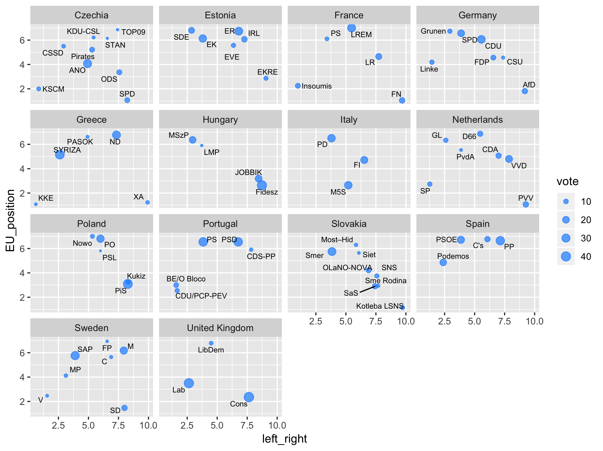

## Source

Chapel Hill expert surveys 1999–2019 – [chesdata.eu](https://www.chesdata.eu/)

+ Bakker, Ryan, Catherine de Vries, Erica Edwards, Liesbet Hooghe, Seth Jolly, Gary Marks, Jonathan Polk, Jan Rovny, Marco Steenbergen, and Milada Vachudova. 2015. "Measuring party positions in Europe: The Chapel Hill expert survey trend file, 1999-2010." Party Politics 21.1: 143–152. doi: [10.1177/1354068812462931](https://doi.org/10.1177/1354068812462931)

+ Bakker, Ryan, Liesbet Hooghe, Seth Jolly, Gary Marks, Jonathan Polk, Jan Rovny, Marco Steenbergen, and Milada Anna Vachudova. 2020. “2019 Chapel Hill Expert Survey.” Version 2019.1. Available on [https://www.chesdata.eu/](chesdata.eu). Chapel Hill, NC: University of North Carolina, Chapel Hill.

+ Polk, Jonathan, Jan Rovny, Ryan Bakker, Erica Edwards, Liesbet Hooghe, Seth Jolly, Jelle Koedam, Filip Kostelka, Gary Marks, Gijs Schumacher, Marco Steenbergen, Milada Vachudova and Marko Zilovic. 2017. "Explaining the salience of anti-elitism and reducing political corruption for political parties in Europe with the 2014 Chapel Hill Expert Survey data," Research & Politics  4(1): 1–9. doi: [10.1177/2053168016686915](https://doi.org/10.1177/2053168016686915)

## Import

+ see CHES 1999-2014 trend file import – `ches-2014`
+ see CHES 2017 flash survey import – `ches-2017`
+ see CHES 2019 import - `ches-2019`
+ see `ches.R` for final party information

---

