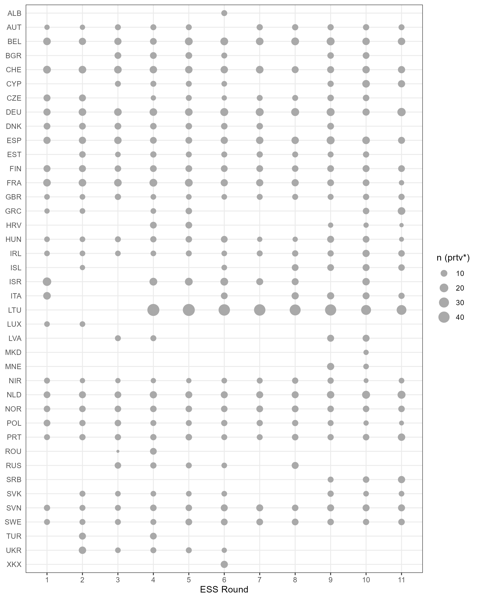

# European Social Survey (ESS) · Rounds 1-11

## Summary

ESS / Party Facts (PF) linking for variables

- **prtv\*** — "Party voted for in last national election, [...]"
- **prtc\*** — "Which party feel closer to, [...]"

Link datasets for ESS and PF ids

- [**essprt-all.csv**](essprt-all.csv) — one observation for each **ESS id** and PF id/data
- [**essprtv.csv**](essprtv.csv) / [**essprtc.csv**](../essprtc/essprtc.csv) — one
  observation for each **ESS party** (harmonized) and PF id/data

`first_ess_id` uniquely identifies an ESS party in PF through harmonization — _see "ESS ids" below_

Additional party names are based on PF data. For the [PF-Web](https://partyfacts.herokuapp.com/data/essprtv/) import,
`name_english` is based on `first_ess_name` to include one ESS party name.

_Note_ — run all scripts in [PF-Data](https://github.com/hdigital/partyfactsdata/tree/main/import/essprtv) with — `purrr::map(fs::dir_ls(".", glob = "*R"), callr::rscript)`

## Article

Bederke, P. and Döring, H. (2023) “Harmonizing and linking party information: The ESS as an example of complex data linking”. Zenodo (preprint). doi: [10.5281/zenodo.10061173](https://doi.org/10.5281/zenodo.10061173)

Bederke, P. and Döring, H. (2023) “Linking European Social Survey (ESS) party information”. Zenodo (software). doi: [10.5281/zenodo.8421232](https://doi.org/10.5281/zenodo.8421232)

Code repository at [github.com/hdigital/ess-linking](https://github.com/hdigital/ess-linking/)
and website at [hdigital.github.io/ess-linking](https://hdigital.github.io/ess-linking/)

## Credits

- Paul Bederke
- Holger Döring
- _Note_ — previous ESS imports (2014, 2015, 2018) in [archive](archive) folder



## Sources

- ESS Round 1: European Social Survey European Research Infrastructure (ESS ERIC) (2023) ESS1 - integrated file, edition 6.7 [Data set]. Sikt - Norwegian Agency for Shared Services in Education and Research. https://doi.org/10.21338/ess1e06_7.
- ESS Round 2: European Social Survey European Research Infrastructure (ESS ERIC) (2012) ESS2 - integrated file, edition 3.6 (Italy not included) [Data set]. Sikt - Norwegian Agency for Shared Services in Education and Research. https://doi.org/10.21338/ess2e03_6.
- ESS Round 2 (Italy): European Social Survey European Research Infrastructure (ESS ERIC) (2012) ESS2 - Italy country file from main questionnaire [Data set]. Sikt - Norwegian Agency for Shared Services in Education and Research. https://doi.org/10.21338/ess2it.
- ESS Round 3: European Social Survey European Research Infrastructure (ESS ERIC) (2018) ESS3 - integrated file, edition 3.7 (Latvia and Romania not included) [Data set]. Sikt - Norwegian Agency for Shared Services in Education and Research. https://doi.org/10.21338/ess3e03_7.
- ESS Round 3 (Latvia): European Social Survey European Research Infrastructure (ESS ERIC) (2018) ESS3 - Latvia (no design weights) [Data set]. Sikt - Norwegian Agency for Shared Services in Education and Research. https://doi.org/10.21338/ess3lv.
- ESS Round 3 (Romania): European Social Survey European Research Infrastructure (ESS ERIC) (2018) ESS3 - Romania (no design weights) [Data set]. Sikt - Norwegian Agency for Shared Services in Education and Research. https://doi.org/10.21338/ess3ro.
- ESS Round 4: European Social Survey European Research Infrastructure (ESS ERIC) (2023) ESS4 - integrated file, edition 4.6 (Austria and Lithuania not included) [Data set]. Sikt - Norwegian Agency for Shared Services in Education and Research. https://doi.org/10.21338/ess4e04_6.
- ESS Round 4 (Austria): European Social Survey European Research Infrastructure (ESS ERIC) (2018) ESS4 - Austria (Fieldwork period 01.11.10 to 28.02.11) [Data set]. Sikt - Norwegian Agency for Shared Services in Education and Research. https://doi.org/10.21338/ess4at.
- ESS Round 4 (Lithuania): European Social Survey European Research Infrastructure (ESS ERIC) (2018) ESS4 - Lithuania (no design weights) [Data set]. Sikt - Norwegian Agency for Shared Services in Education and Research. https://doi.org/10.21338/ess4lt.
- ESS Round 5: European Social Survey European Research Infrastructure (ESS ERIC) (2023) ESS5 - integrated file, edition 3.5 (Austria not included) [Data set]. Sikt - Norwegian Agency for Shared Services in Education and Research. https://doi.org/10.21338/ess5e03_5.
- ESS Round 5 (Austria): European Social Survey European Research Infrastructure (ESS ERIC) (2017) ESS5 - Austria (fieldwork period 24.05.13 to 10.10.13) [Data set]. Sikt - Norwegian Agency for Shared Services in Education and Research. https://doi.org/10.21338/ess5ate1_1.
- ESS Round 6: European Social Survey European Research Infrastructure (ESS ERIC) (2023) ESS6 - integrated file, edition 2.6 [Data set]. Sikt - Norwegian Agency for Shared Services in Education and Research. https://doi.org/10.21338/ess6e02_6.
- ESS Round 7: European Social Survey European Research Infrastructure (ESS ERIC) (2023) ESS7 - integrated file, edition 2.3 [Data set]. Sikt - Norwegian Agency for Shared Services in Education and Research. https://doi.org/10.21338/ess7e02_3.
- ESS Round 8: European Social Survey European Research Infrastructure (ESS ERIC) (2023) ESS8 - integrated file, edition 2.3 [Data set]. Sikt - Norwegian Agency for Shared Services in Education and Research. https://doi.org/10.21338/ess8e02_3.
- ESS Round 9: European Social Survey European Research Infrastructure (ESS ERIC) (2023) ESS9 - integrated file, edition 3.2 [Data set]. Sikt - Norwegian Agency for Shared Services in Education and Research. https://doi.org/10.21338/ess9e03_2.
- ESS Round 10: European Social Survey European Research Infrastructure (ESS ERIC) (2023) ESS10 - integrated file, edition 3.2 [Data set]. Sikt - Norwegian Agency for Shared Services in Education and Research. https://doi.org/10.21338/ess10e03_2.
- ESS Round 10 (SC): European Social Survey European Research Infrastructure (ESS ERIC) (2023) ESS10 Self-completion - integrated file, edition 3.1 [Data set]. Sikt - Norwegian Agency for Shared Services in Education and Research. https://doi.org/10.21338/ess10sce03_1.
- ESS Round 11: European Social Survey European Research Infrastructure (ESS ERIC) (2024) ESS11 - integrated file, edition 2.0 [Data set]. Sikt - Norwegian Agency for Shared Services in Education and Research. https://doi.org/10.21338/ess11e02_0.

---

## Import details

ESS rounds may use different party ids between rounds and variables — _see "ESS ids" below_

We harmonize ESS party ids in [02-ess-harmonize.csv](02-ess-harmonize.csv)
with `first_ess_id` and `country`

## Steps

- **01-ess-prt-raw**
  - extract party names for all ESS variables starting with `prtv*` and `prtc*`
  - define `ess_id` (country, round, party id, prt\*) — _see "ESS ids" below_
  - based on ESS Stata files in "source\_\_ess" (not in Git repo)
- **02-ess-harmonize**
  - harmonize ESS party ids from Step-1
  - `ess_first_id` and `country` are **edited manually**
  - script replaces all Step-1 variables from "02-ess-harmonize.csv"
- **03-essprt**
  - create link datasets — _see "Summary" above_

## ESS ids

- ESS party id issues
  - different between ESS rounds
    - e.g. Dutch [Christian Democratic Party](https://partyfacts.herokuapp.com/data/partyall/46447/) — variable `prtvtnl`
    - `ess_id` — e.g. NL-1-1-v, NL-5-4-v, NL-7-5-v
  - different within one ESS round
    - e.g. Finland ESS Round 9
    - [Green League](https://partyfacts.herokuapp.com/data/partyall/45319/) (FI-9-11-c) — variable `prtctfi`
    - [Social Democratic
      Party](https://partyfacts.herokuapp.com/data/partyall/46025/) (FI-9-11-v) —
      variable `prtvlfi`
- `ess_id` and `first_ess_id`
  - consist of `cntry-essround-ess_party_id-prt_v/c`
    - R tidyverse code — `mutate(ess_id = paste(cntry, essround, ess_party_id,
substr(variable, 4, 4), sep = "-"))`
    - e.g. FR-1-1-v
  - in case of DEU and LTU the voting tier is added as additional identification
    - R tidyverse code — `mutate(ess_id = paste(cntry, essround, party_id, substr(variable, 4, 4), str_sub(variable, -3, -1), sep = "-"))`
    - e.g. DE-1-1-v-de2
- `first_ess_id`
  - used as a **unique identifier** (harmonized) of a party within ESS ids
  - parties are imported into
    [PF-Web](https://partyfacts.herokuapp.com/data/essprtv/) with this first
    prtv*/prtc* ESS id
  - _see Step-2 above_
- `ess_id`
  - not unique for some `prtv*` variables
  - different variables for tier votes in DEU and LTU
  - e.g. `prtvade2` and `prtvblt3`

### Code Snippet

```R
 mutate(ess_id = case_when(
  cntry %in% c("DE", "LT") & str_detect(variable, "prtv") ~ paste(
      cntry,
      essround,
      party_id,
      substr(variable, 4, 4),
      str_sub(variable, -3, -1),
      sep = "-"
      ),
    T ~ paste(
      cntry,
      essround,
      party_id,
      substr(variable, 4, 4),
      sep = "-"
      )
    )
  )
```

see [01-ess-prt-raw.R](01-ess-prt-raw.R)
