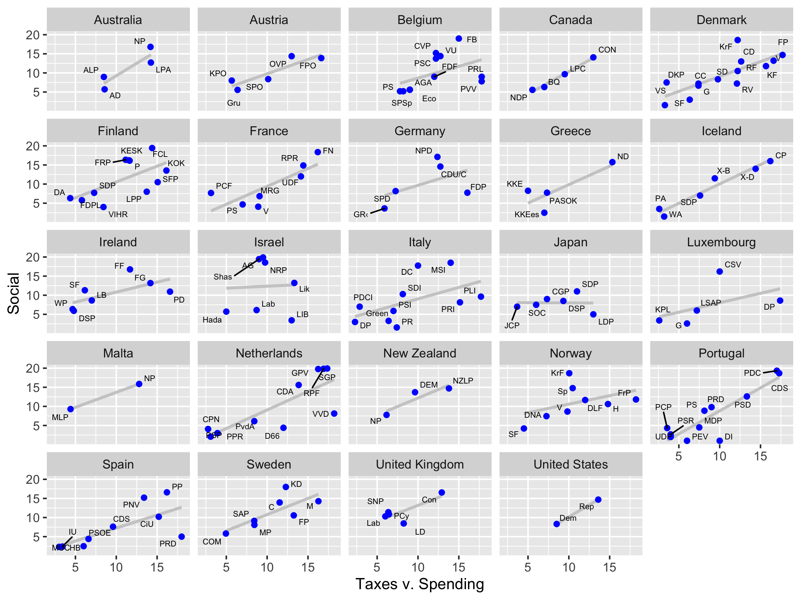

# Source

+ Laver, Michael, and W. Ben Hunt. 1992. Policy and Party Competition. New York: Routledge.

## Credits

+ Ken Benoit -- London School of Economics -- 2019

## Import

+ Laver/Hunt dataset provided by Ken Benoit (PPMD version)

---

