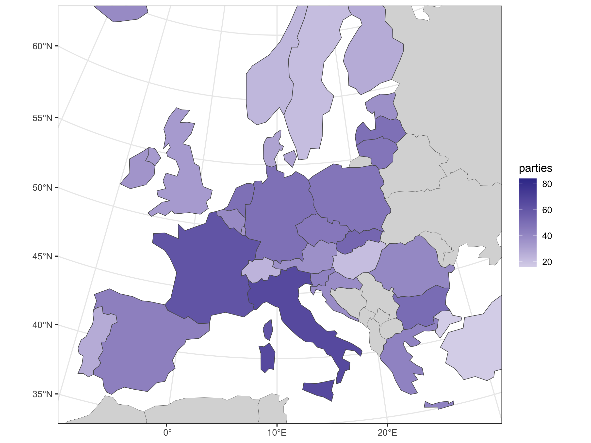
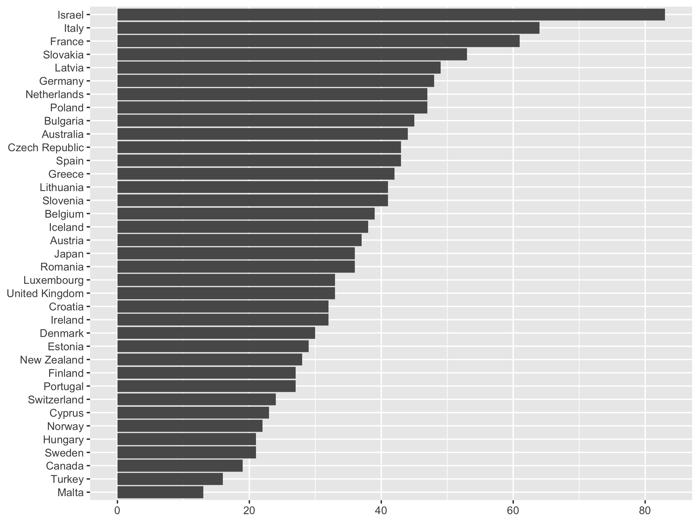

## Source

Döring, Holger, and Philip Manow. 2024. Parliaments and governments database
(ParlGov): Information on parties, elections and cabinets in established
democracies. – [parlgov.org](https://parlgov.org/)

Döring, Holger, and Philip Manow. 2024. “ParlGov 2024 Release.”
[doi:10.7910/DVN/2VZ5ZC](https://doi.org/10.7910/DVN/2VZ5ZC).

## Import

- excluding smaller parties
  - < 1% share in national election
  - < 3 election results
  - not in cabinet
- see `parlgov.R`

______________________________________________________________________

