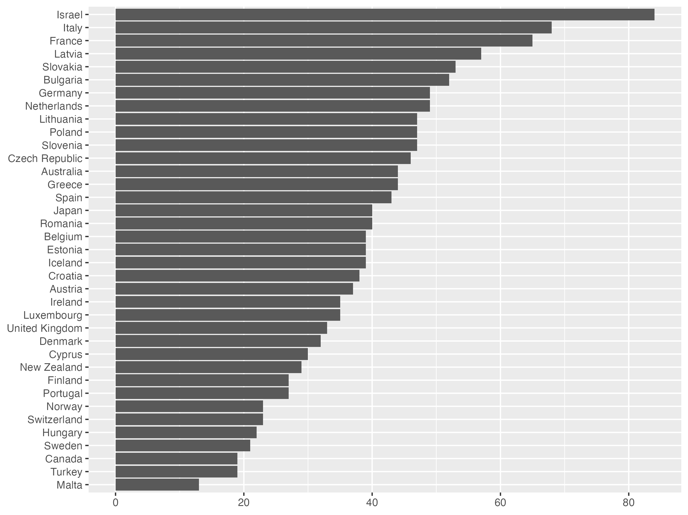

## Source

Döring, Holger, Alexandra Quaas, Maike Hesse, and Philip Manow. 2023. Parliaments and governments database (ParlGov): Information on parties, elections and cabinets in established democracies. Development version. – [parlgov.org](http://www.parlgov.org/)

## Import

+ excluding smaller parties
  + < 1% share in national election
  + < 3 election results
  + not in cabinet
+ see `parlgov.R`

---

