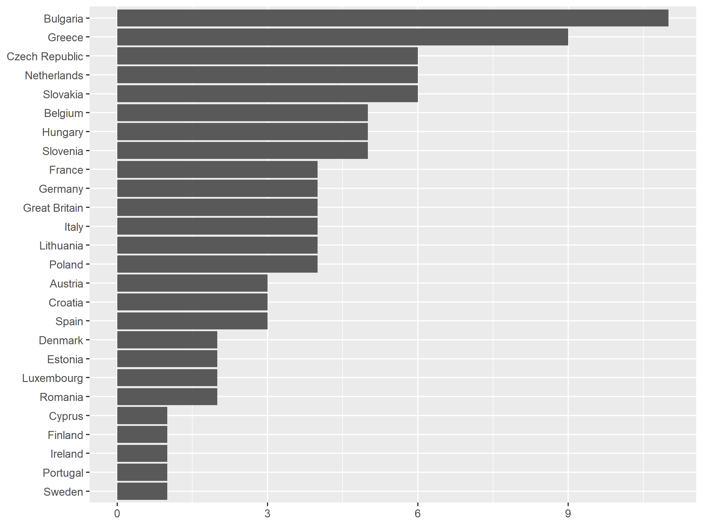

# PPEPE

+ Zulianello, Mattia, and Erik Gahner Larsen. 2021. “Populist Parties in European Parliament Elections: A New Dataset on Left, Right and Valence Populism from 1979 to 2019.” Electoral Studies 71: 102312. doi: [10.1016/j.electstud.2021.102312](https://www.doi.org/10.1016/j.electstud.2021.102312)
+ Larsen, Erik Gahner, and Mattia Zulianello. 2021. “Populist Parties in European Parliament Elections.” Harvard Dataverse, V1, UNF:6:yQK5WxJrC5re7OPJbeJbOw== [fileUNF] — doi: [10.7910/DVN/RFRCZS](https://www.doi.org/10.7910/DVN/RFRCZS)

---

