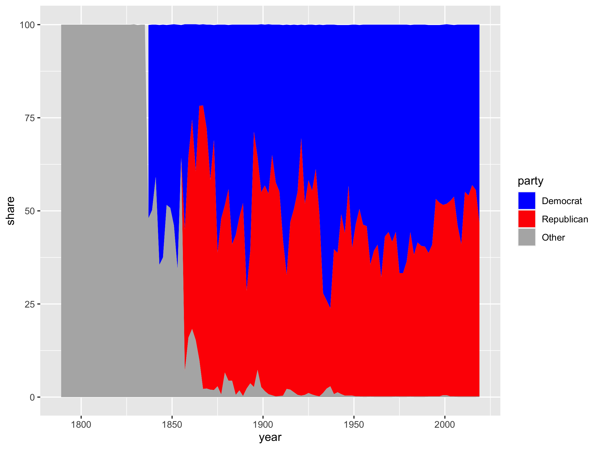

# Dataset name

## Source

+ Jeffrey B. Lewis et al. 2020. “Voteview: Congressional Roll-Call Votes Database.” [voteview.com](https://www.voteview.com)

## Import

+ "Congressional Parties" dataset from Voteview
+ see `voteview.R`

---

