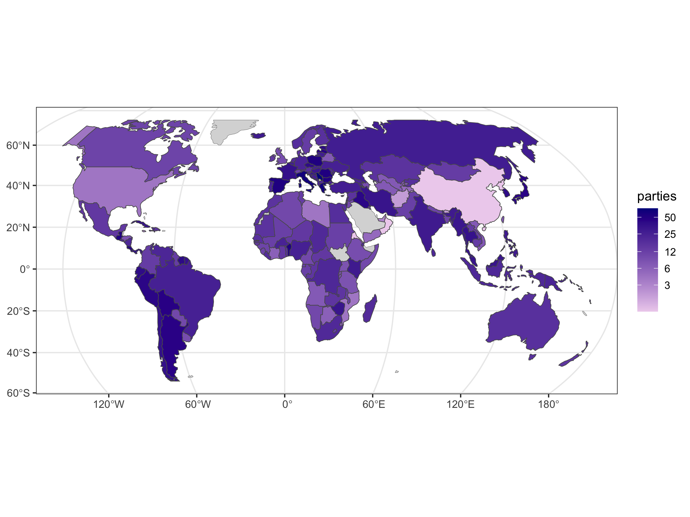

# Varieties of Party Identity and Organization (V-Party)

## Source

Lührmann, Anna, Nils Düpont, Masaaki Higashijima, Yaman Berker Kavasoglu, Kyle L. Marquardt, Michael Bernhard, Holger Döring, Allen Hicken, Melis Laebens, Staffan I. Lindberg, Juraj Medzihorsky, Anja Neundorf, Ora John Reuter, Saskia Ruth-Lovell, Keith R. Weghorst, Nina Wiesehomeier, JosephWright, Nazifa Alizada, Paul Bederke, Lisa Gastaldi, Sandra Grahn, Garry Hindle, Nina Ilchenko, Johannes von Römer, Steven Wilson, Daniel Pemstein, Brigitte Seim. 2020. Varieties of Party Identity and Organization (V-Party) Dataset V1. Varieties of Democracy (V-Dem) Project. [https://doi.org/10.23696/vpartydsv1](https://doi.org/10.23696/vpartydsv1)

Pemstein, Daniel, Kyle L. Marquardt, Eitan Tzelgov, Yi-ting Wang, Juraj Medzihorsky, Joshua Krusell, Farhad Miri, and Johannes von Römer. 2020. "The V-Dem Measurement Model: Latent Variable Analysis for Cross-National and Cross-Temporal Expert-Coded Data". V-Dem Working Paper No. 21. 5th edition. University of Gothenburg: Varieties of Democracy Institute.

[https://www.v-dem.net/en/](https://www.v-dem.net/en/)

---

