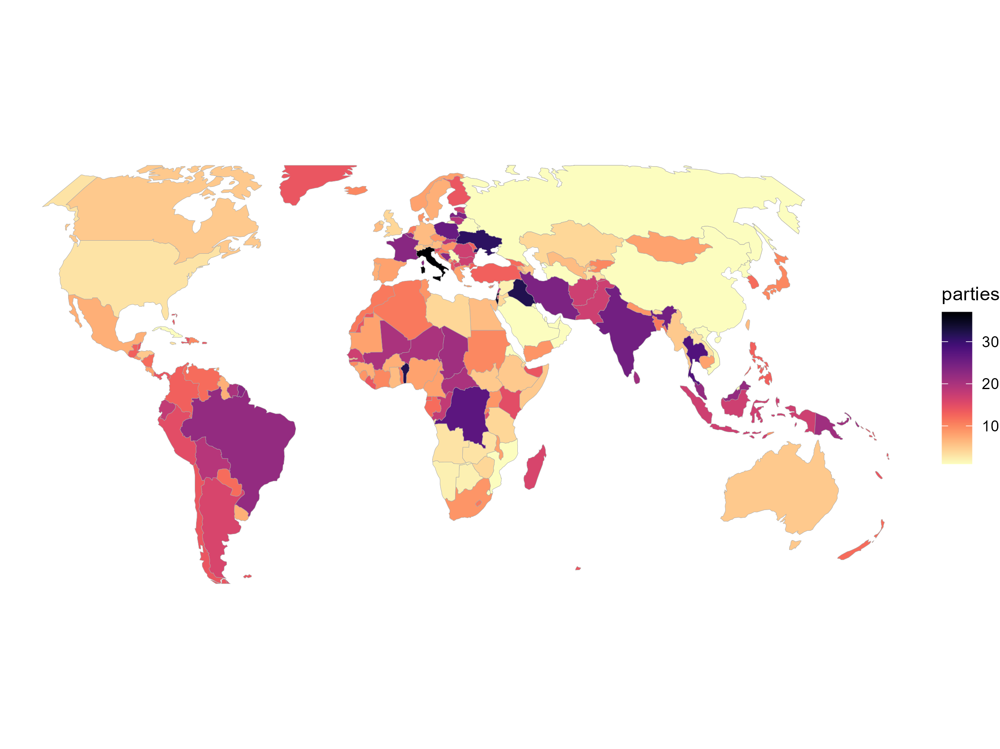

# WhoGov

## Source

+ Nyrup, Jacob, and Stuart Bramwell. 2020. Who Governs? A New Global Dataset on Members of Cabinets. American Political Science Review. 114(4): 1366–74. [doi: 10.1017/S0003055420000490](https://doi.org/10.1017/S0003055420000490)

+ <https://politicscentre.nuffield.ox.ac.uk/whogov-dataset/>

## Import

+ imports
  + _initial import_  — all WhoGov data and automatic linking during import in PF-Web
  + _final import_ — parties with 3 ministers and those linked automatically before
+ encoding issues
  + The WhoGov dataset file contains multiple encoding issues
  + Fields with problematic encodings are replaced with `NA`

## Variables

- `country_short` -- ISO 3166-1 alpha-3 [adjusted]
- `name_short` -- party abbreviation based on `party` (see *whogov.R*)
- `name_english` -- party name english based on `party_english` (see *whogov.R*)
- `name` -- party name based on `party_otherlanguage` (see *whogov.R*)
- `year_first` -- first dataset appearance of party
- `year_last` -- last dataset appearance of party
- `n` -- number of ministers
- `minister_first` -- first minister of the party
- `party` -- party abbreviation as in dataset
- `party_id` -- `country_isocode`-`party` (see *whogov.R*)
- `partyfacts_id` -- partyfacts_id of the party (already linked to in Party Facts)

