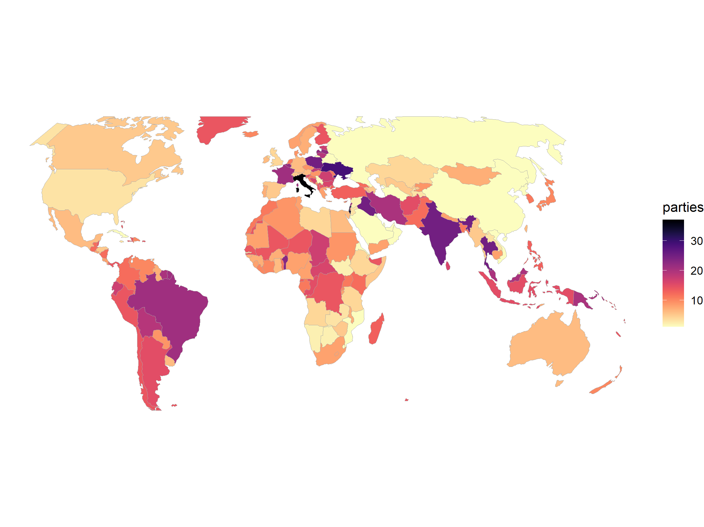

# WhoGov

## Source

+ Nyrup, Jacob, and Stuart Bramwell. 2020. Who Governs? A New Global Dataset on Members of Cabinets. American Political Science Review. 1-9. FirstView. [doi: 10.1017/S0003055420000490](https://doi.org/10.1017/S0003055420000490)

+ <https://www.nuffield.ox.ac.uk/our-research/research-centres/nuffield-politics-research-centre/whogov>

## Import

+ converted encoding of `WhoGov_within_V1.2.csv` from _Windows-1252_ to _utf-8_
  + `iconv -f Windows-1252 -t utf-8 WhoGov_within_V1.2.csv > WhoGov_within_V1.2_utf-8.csv`
+ imports
  + _initial import_  — all WhoGov data and automatic linking during import in PF-Web
  + _final import_ — parties with 5 ministers and those linked automatically before

## Linking status

+ completed linking of nearly all parties (~99%)

